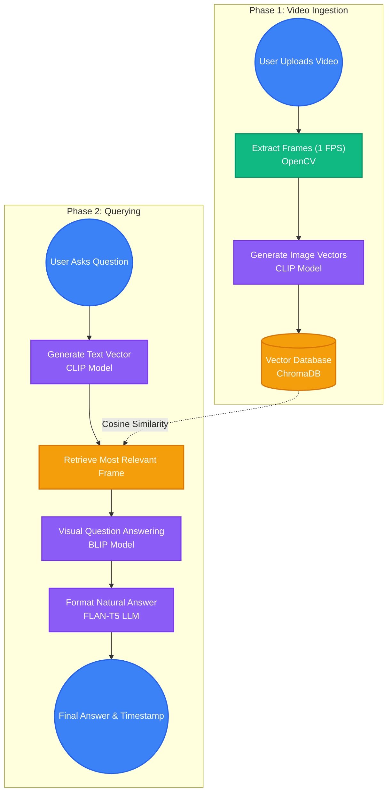

# VIQA: Video Question Answering System

VIQA is an intelligent application that allows users to upload video files and ask natural language questions about the video's content. Using advanced Computer Vision and NLP models from Hugging Face, it extracts the exact timestamp and provides a conversational answer to your queries.

## 🧠 How It Works

The system operates in two main phases: **Video Ingestion (Upload)** and **Semantic Search & Answering (Query)**.



### Core Technologies
- **OpenCV**: Used to extract frames sequentially from the uploaded video.
- **CLIP (`openai/clip-vit-base-patch32`)**: Bridges vision and language. It embeds both the video frames and the user's text question into the same vector space to locate the exact visual moment the question refers to.
- **ChromaDB**: An ultra-fast vector database that stores and retrieves the frame embeddings via Cosine Similarity.
- **BLIP (`Salesforce/blip-vqa-base`)**: A Visual Question Answering model that looks at the retrieved frame and provides a raw, contextual answer to the user's question.
- **FLAN-T5 (`google/flan-t5-small`)**: An efficient Large Language Model used to semantically format the raw BLIP answer and timestamp into a cohesive, readable sentence.

---

## 🚀 Setup & Installation

### 1. Prerequisites
- **Node.js**: For running the React (Vite) frontend environment.
- **Python 3.x**: For running the FastAPI backend server.
- **Git**: To clone the repository.

### 2. Environment Variables
To securely download the AI models without encountering Hugging Face rate limits, you must provide your Hugging Face authentication token.
1. Create a `.env` file in the root directory alongside the frontend configuration.
2. Add your token:
```env
HF_TOKEN=hf_your_huggingface_token_here
```

### 3. Backend Setup (FastAPI)
The backend requires several ML libraries including `torch`, `transformers`, `chromadb`, `opencv-python`, and `fastapi`.

1. Open a terminal and navigate to the backend folder:
   ```bash
   cd backend
   ```
2. Activate your virtual environment and install the dependencies (e.g., via `pip install -r requirements.txt`).
3. Start the Uvicorn server:
   ```bash
   python -m uvicorn main:app --port 8000 --reload
   ```

### 4. Frontend Setup (React/Vite)
The frontend drives the clean user interface.

1. Open a new terminal session in the root folder.
2. Install the necessary Node modules:
   ```bash
   npm install
   ```
3. Start the development server:
   ```bash
   npm run dev
   ```

The application UI will now be accessible at `http://localhost:5173`. Upload a video to initialize the pipeline, wait for the AI to process the embeddings, and ask your questions!
