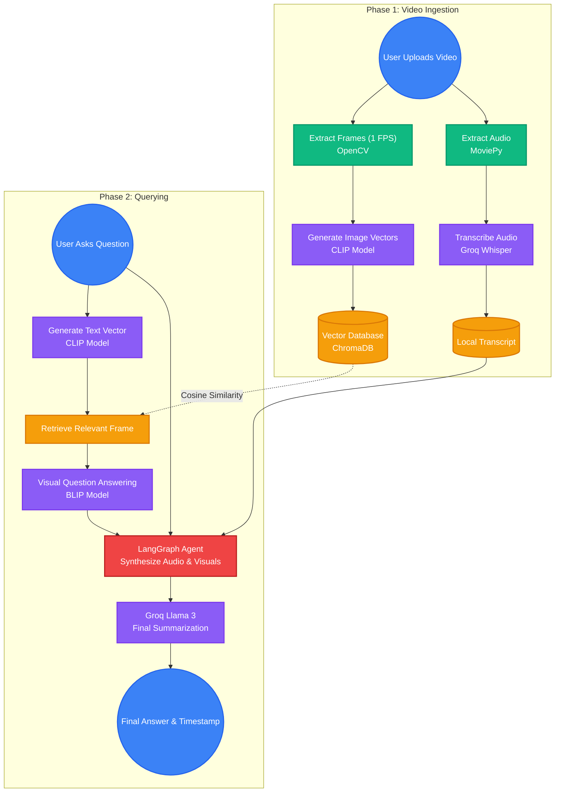

# VIQA: Video Question Answering System

VIQA is an intelligent application that allows users to upload video files and ask natural language questions about the video's content. Using advanced Computer Vision, NLP models from Hugging Face, and state-of-the-art LLMs via Groq, it extracts exact timestamps, transcribes video audio, and provides conversational, highly contextual answers to your queries.

## 🧠 How It Works

The system operates in two main phases: **Video Ingestion (Upload)** and **Semantic Search & Answering (Query)**.



### Core Technologies
- **OpenCV & MoviePy**: Used to extract visual frames sequentially and rip the audio track natively from the uploaded video.
- **Groq Whisper API**: Transcribes the extracted audio track into an accurate text log, unlocking the ability to summarize the entire video based on spoken context.
- **CLIP (`openai/clip-vit-base-patch32`)**: Bridges vision and language. It embeds both the video frames and the user's text question into the same vector space to locate the exact visual moment the question refers to.
- **ChromaDB**: An ultra-fast vector database that stores and retrieves the frame embeddings via Cosine Similarity.
- **BLIP (`Salesforce/blip-vqa-base`)**: A Visual Question Answering model that looks at the retrieved frame and provides a raw, contextual answer about what is seen.
- **LangGraph & Groq (Llama-3)**: Acts as the master agent. It pulls the visual answer from BLIP and the full audio transcript from Whisper, and uses a state-of-the-art LLM to generate a fully comprehensive final answer that covers both the visual action and the spoken context of the video!

---

## 🚀 Setup & Installation

### 1. Prerequisites
- **Node.js**: For running the React (Vite) frontend environment.
- **Python 3.x**: For running the FastAPI backend server.
- **Git**: To clone the repository.

### 2. Environment Variables
To securely download the AI models and utilize Groq's APIs, you must provide your authentication keys.
1. Create a `.env` file in the root directory.
2. Add your tokens:
```env
HF_TOKEN=hf_your_huggingface_token_here
GROQ_API_KEY=gsk_your_groq_api_key_here
```

### 3. Backend Setup (FastAPI)
The backend leverages PyTorch, Transformers, ChromaDB, OpenCV, MoviePy, and LangGraph.

1. Open a terminal and navigate to the backend folder:
   ```bash
   cd backend
   ```
2. Activate your virtual environment and install the dependencies.
   ```bash
   pip install -r requirements.txt
   ```
3. Start the Uvicorn server:
   ```bash
   python -m uvicorn main:app --port 8000 --reload
   ```

### 4. Frontend Setup (React/Vite)
The frontend drives the clean user interface.

1. Open a new terminal session in the root folder.
2. Install the necessary Node modules:
   ```bash
   npm install
   ```
3. Start the development server:
   ```bash
   npm run dev
   ```

The application UI will now be accessible at `http://localhost:5173`. Upload a video to initialize both the visual vector database and the audio transcript pipeline. Once complete, you can ask for video summaries, moral of stories, and visual details!
